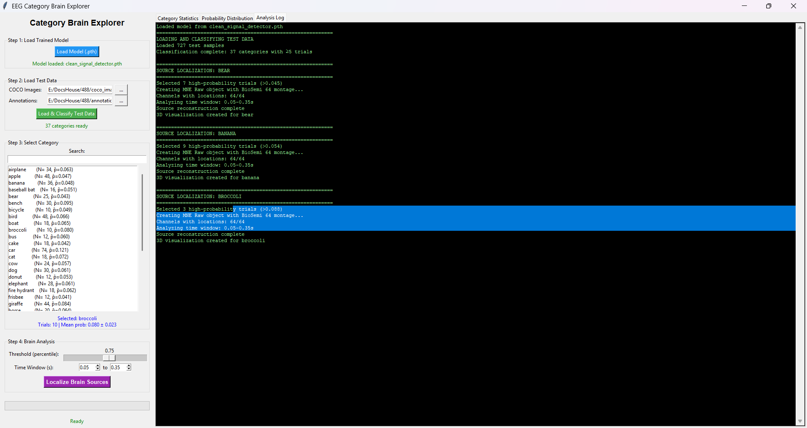
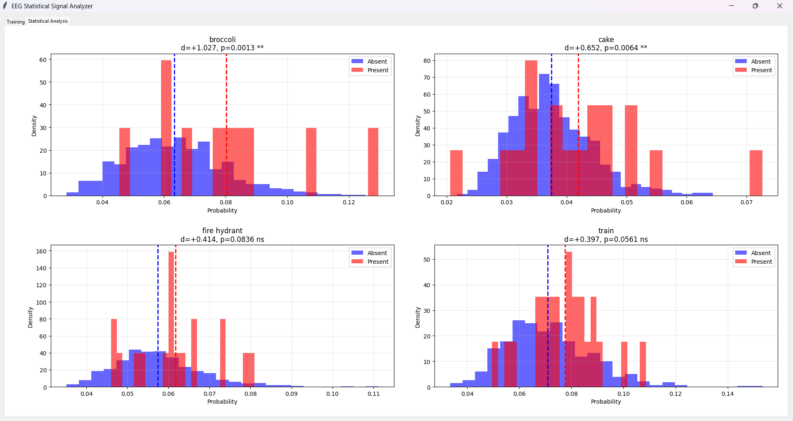

# EEG Weak Signal Category Detection

Research code for detecting weak category-specific signals in EEG data during visual object perception.

Overview
This project explores whether electroencephalography (EEG) recordings contain subtle information about viewed object categories,
even when environmental confounds are controlled. Using the Alljoined EEG-Image dataset and multi-label classification, we detect 
small but statistically significant probability shifts (Δ ~0.3-1.7%) for certain object categories.
Dataset
Uses the Alljoined EEG-Image Dataset (Gifford et al., 2022):

6,000+ images from COCO dataset
64-channel BioSemi EEG recordings
Multiple subjects viewing images in controlled laboratory setting

# Citation:

(I have nothing to do with this team, I just vibecoded this app after months of trying to do braindecoding.)

@article{gifford2022alljoined,
  title={The Alljoined EEG-Image Dataset},
  author={Gifford, A. and others},
  journal={arXiv preprint arXiv:2210.09450},
  year={2022}
}

https://arxiv.org/abs/2404.05553

# Key Findings

Statistically significant signals detected:

Broccoli: d=1.027, p=0.001 (large effect)
Cake: d=0.652, p=0.006 (medium effect)
Train: d=0.397, p=0.056 (small effect, marginal)
Fire hydrant: d=0.414, p=0.084 (small effect, marginal)

# Temporal dynamics:

Weak early activity (0-200ms): Generic visual processing
Stronger late activity (200-350ms): Category-specific semantic processing

Source localization:

Primary activation in ventral temporal cortex (object recognition pathway)
Food items show consistent fusiform/temporal activation
Animals show broader parietal/temporal patterns

# Important Limitations

Weak signals: Effect sizes are small (d<1.0 for most categories). Mean probability shifts are 0.3-1.7%, not suitable for reliable single-trial decoding.
Environmental contamination: Objects present in the lab (person, chair) show 3-4× stronger signals, indicating non-image-related confounds.
Source localization constraints: EEG has ~1-2cm spatial resolution. Deep structures (amygdala, hippocampus) cannot be reliably localized with surface electrodes.
Sample size: Some categories have N<20 trials in test set, limiting statistical power.

This is exploratory research code demonstrating weak semantic encoding in EEG, not a production brain-computer interface.

# Components

1. Trainer (Trainer.py)

CNN classifier with statistical analysis
Multi-label binary classification (38 categories)
Excludes lab objects (person, chair, laptop, book) to reduce contamination
Outputs t-tests, Cohen's d effect sizes, and probability distributions

2. Brain Explorer (App.py)

Loads trained model and classifies test data
Source localization using MNE-Python (sLORETA)
3D brain visualization showing category-specific activation patterns
Interactive category selection and probability thresholding

# Installation

pip install torch torchvision mne datasets scipy matplotlib pyvistaqt

Requires COCO annotations JSON file (not included).

# Usage

# Training

python Trainer.py

Select COCO images directory and annotations file

Configure time window (default: 50-350ms)

Train model (saves to clean_signal_detector.pth)

Run statistical analysis on test set

# Brain Localization

python App.py

Load trained .pth model

Load test data and classify

Select category from list

Click "Localize Brain Sources" for 3D visualization

# Architecture

CNN Classifier:

3 convolutional blocks (128→256→512 channels)
Batch normalization + ELU activation
MaxPooling after each block
3-layer fully connected classifier with dropout (0.5)
BCE loss for multi-label classification

Input: 64-channel EEG, 50-350ms time window (154 timepoints)
Output: 38 class probabilities (sigmoid)
Results Interpretation
What the probability shifts mean:

High-probability trials (p>0.08 for broccoli) show stronger semantic processing
Bimodal distributions (e.g., fire hydrant) suggest saliency/attention effects
Similar temporal dynamics across categories indicate shared object recognition network

# Brain activation patterns:

Occipital cortex (100-200ms): Early visual processing
Temporal cortex (200-300ms): Object category encoding
Parietal cortex: Attention/saliency for behaviorally relevant objects

# Technical Notes

Alljoined team Used BioSemi 64-channel montage
Forward model: 3-layer BEM (brain, skull, scalp)
Inverse solution: sLORETA with λ²=1/9
Source space: fsaverage template (ico4 spacing)
Percentile-based color scaling (95th-99th) for visualization

# License

Research/educational use. If using this code, please cite the Alljoined dataset paper.

# Acknowledgments

Built using MNE-Python, PyTorch, and the Alljoined EEG-Image dataset.
